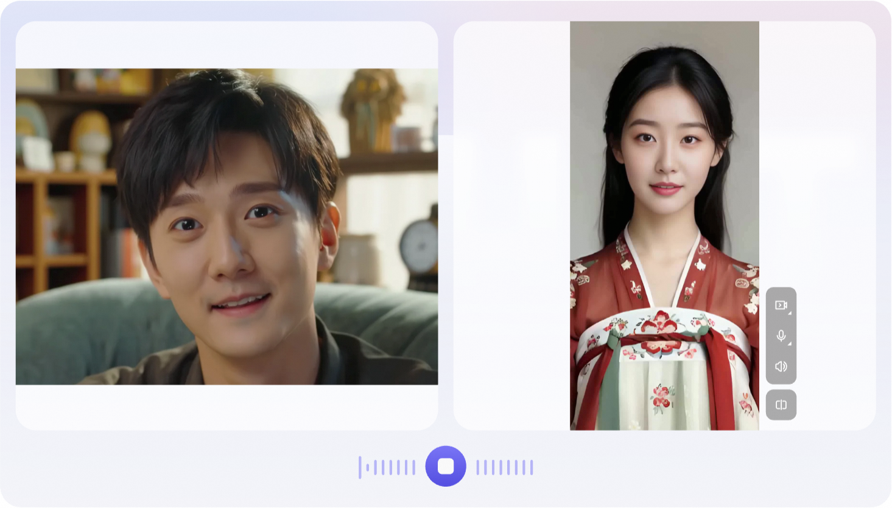

<div style='text-align: center; margin-bottom: 1rem; display: flex; justify-content: center; align-items: center;'>
    <h1 style='color: white; margin: 0;'>FastRTC</h1>
    
</div>

<div style="display: flex; flex-direction: row; justify-content: center">
 
<a href="https://github.com/freddyaboulton/fastrtc" target="_blank"></a>
</div>
<div align="center">
<strong>中文|<a href="./README_en.md">English</a></strong>
</div>

本仓库是从原有的 gradio_webrtc 仓库 fork 而来，主要增加了`video_chat`作为允许的入参，并默认开启，这个模式和原有的`modality="audio-video"`且`mode="send-receive"`的行为保持一致，但重写了 UI 部分，增加了更多的交互能力(更多的麦克风操作，同时展示本地视频信息），其视觉表现如下图。

如果手动将`video_chat`参数设置为`False`，则其用法与原仓库保持一致 https://freddyaboulton.github.io/gradio-webrtc/




## Installation

```bash
gradio cc install
gradio cc build --no-generate-docs
```

```bash
pip install dist/fastrtc-0.0.15.dev0-py3-none-any.whl
```

## Docs

[https://fastrtc.org](https://fastrtc.org)

## Examples

使用时需要一个 handler 作为组件的入参，并实现类似以下代码：

```python
import asyncio
import base64
from io import BytesIO

import gradio as gr
import numpy as np
from gradio_webrtc import (
    AsyncAudioVideoStreamHandler,
    WebRTC,
    VideoEmitType,
    AudioEmitType,
)
from PIL import Image


def encode_audio(data: np.ndarray) -> dict:
    """Encode Audio data to send to the server"""
    return {"mime_type": "audio/pcm", "data": base64.b64encode(data.tobytes()).decode("UTF-8")}


def encode_image(data: np.ndarray) -> dict:
    with BytesIO() as output_bytes:
        pil_image = Image.fromarray(data)
        pil_image.save(output_bytes, "JPEG")
        bytes_data = output_bytes.getvalue()
    base64_str = str(base64.b64encode(bytes_data), "utf-8")
    return {"mime_type": "image/jpeg", "data": base64_str}


class VideoChatHandler(AsyncAudioVideoStreamHandler):
    def __init__(
        self, expected_layout="mono", output_sample_rate=24000, output_frame_size=480
    ) -> None:
        super().__init__(
            expected_layout,
            output_sample_rate,
            output_frame_size,
            input_sample_rate=24000,
        )
        self.audio_queue = asyncio.Queue()
        self.video_queue = asyncio.Queue()
        self.quit = asyncio.Event()
        self.session = None
        self.last_frame_time = 0

    def copy(self) -> "VideoChatHandler":
        return VideoChatHandler(
            expected_layout=self.expected_layout,
            output_sample_rate=self.output_sample_rate,
            output_frame_size=self.output_frame_size,
        )

    #处理客户端上传的视频数据
    async def video_receive(self, frame: np.ndarray):
        newFrame = np.array(frame)
        newFrame[0:, :, 0] = 255 - newFrame[0:, :, 0]
        self.video_queue.put_nowait(newFrame)

    #准备服务端下发的视频数据
    async def video_emit(self) -> VideoEmitType:
        return await self.video_queue.get()

    #处理客户端上传的音频数据
    async def receive(self, frame: tuple[int, np.ndarray]) -> None:
        frame_size, array = frame
        self.audio_queue.put_nowait(array)

    #准备服务端下发的音频数据
    async def emit(self) -> AudioEmitType:
        if not self.args_set.is_set():
            await self.wait_for_args()
        array = await self.audio_queue.get()
        return (self.output_sample_rate, array)

    def shutdown(self) -> None:
        self.quit.set()
        self.connection = None
        self.args_set.clear()
        self.quit.clear()


css = """
footer {
	display: none !important;
}
"""

with gr.Blocks(css=css) as demo:
        webrtc = WebRTC(
            label="Video Chat",
            modality="audio-video",
            mode="send-receive",
            video_chat=True,
            elem_id="video-source",
        )
        webrtc.stream(
            VideoChatHandler(),
            inputs=[webrtc],
            outputs=[webrtc],
            time_limit=150,
            concurrency_limit=2,
        )


if __name__ == "__main__":
    demo.launch()

```

## Deployment

在云环境中部署（例如 huggingface，EC2 等）时，您需要设置转向服务器以中继 WEBRTC 流量。
最简单的方法是使用 Twilio 之类的服务。国内部署需要寻找适合的替代方案。

```python
from twilio.rest import Client
import os

account_sid = os.environ.get("TWILIO_ACCOUNT_SID")
auth_token = os.environ.get("TWILIO_AUTH_TOKEN")

client = Client(account_sid, auth_token)

token = client.tokens.create()

rtc_configuration = {
    "iceServers": token.ice_servers,
    "iceTransportPolicy": "relay",
}

with gr.Blocks() as demo:
    ...
    rtc = WebRTC(rtc_configuration=rtc_configuration, ...)
    ...
```

## Contributors

[csxh47](https://github.com/xhup)
[bingochaos](https://github.com/bingochaos)
[sudowind](https://github.com/sudowind)
[emililykimura](https://github.com/emililykimura)
[Tony](https://github.com/raidios)
[Cheng Gang](https://github.com/lovepope)
